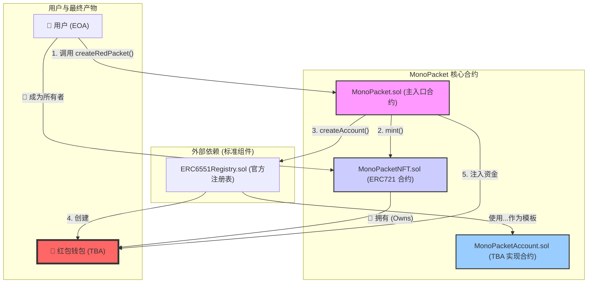

# MonaPacket

本仓库包含基于 Foundry 的 MonaPacket 合约与脚本，当前实现以 `contracts` 目录为主：
- 核心合约：`MonaPacket.sol`、`MonaPacketNFT.sol`、`MonaPacketAccount.sol`、`ERC6551Registry.sol`
- 测试：位于 `contracts/test/`，覆盖创建、TBA 执行、注册表分支、部署脚本写文件等
- 部署脚本：`contracts/script/MonaPacket.s.sol`，将部署信息写入 `contracts/deployments/MonaPacket.json`

### 部署脚本

```bash
cd contracts
forge build
export PRIVATE_KEY=<hex_private_key>
forge script script/MonaPacket.s.sol:MonaPacketScript \
  --broadcast --rpc-url <your_rpc_url>
```

运行后会在 `contracts/deployments/MonaPacket.json` 生成部署信息文件。

## 系统架构 (System Architecture)



## 智能合约接口文档 (Smart Contract API)

IMonoPacket (主入口合约)，用户交互的中心枢纽。

```
interface IMonoPacket {
    /**
     * @dev 当一个红包被成功创建时触发。前端可以监听此事件来更新 UI。
     * @param tokenId 新铸造的 MonoPacketNFT 的 ID。
     * @param nftContract NFT 合约地址。
     * @param recipient 红包 NFT 的接收者地址。
     * @param tbaAddress 为该 NFT 创建的 TBA 钱包地址。
     * @param amount 存入该红包的金额 (in wei)。
     */
    event RedPacketCreated(
        uint256 indexed tokenId,
        address indexed nftContract,
        address indexed recipient,
        address tbaAddress,
        uint256 amount
    );

    /**
     * @dev 创建一个红包。用户调用此函数，并通过 `payable` 关键字附带 ETH 作为红包资金。
     * @param recipient 红包 NFT 的接收者。
     * @param tokenURI NFT 的元数据 URI (例如，指向一个包含祝福语和图片的 IPFS JSON 文件)。
     * @return tbaAddress 新创建的 TBA 钱包地址。
     */
    function createRedPacket(
        address recipient,
        string calldata tokenURI
    ) external payable returns (address tbaAddress);
}
```

IMonoPacketNFT (NFT 合约)，代表“红包封皮”的 ERC-721 合约。

```
interface IMonoPacketNFT is IERC721 {
    /**
     * @dev 铸造一个新的红包 NFT。此函数应被设置为只能由主入口合约 (MonoPacket.sol) 调用。
     * @param to NFT 的接收者地址。
     * @param tokenURI NFT 的元数据 URI。
     * @return tokenId 新铸造的 NFT 的 ID。
     */
    function mint(address to, string calldata tokenURI) external returns (uint256);
}
```

IMonoPacketAccount (红包钱包合约)，TBA 的具体实现，定义了红包钱包的行为。

```
interface IMonoPacketAccount {
    /**
     * @dev 允许红包所有者 (即 NFT 的持有者) 从红包钱包中提取资金。
     * 函数内部必须有权限校验，确保调用者是该 TBA 对应 NFT 的所有者。
     * @param to 资金接收地址。
     * @param amount 要提取的金额。
     */
    function withdraw(address payable to, uint256 amount) external;

    /**
     * @dev 使合约能够接收 ETH。
     */
    receive() external payable;

    // --- 兼容 ERC-6551 标准所需的核心函数 ---

    function execute(address to, uint256 value, bytes calldata data, uint256 operation) external payable returns (bytes memory);
    function token() external view returns (uint256 chainId, address tokenContract, uint256 tokenId);
    function owner() external view returns (address);
}
```