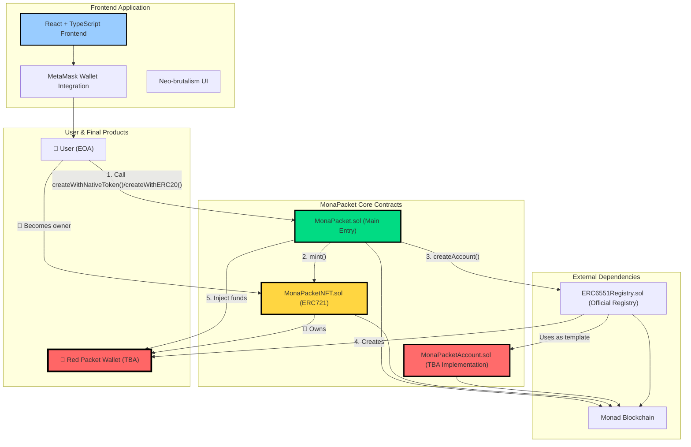

# 🧧 MonaPacket - Decentralized Red Packet System

A complete decentralized red packet (hongbao) application built on the Monad blockchain, featuring smart contracts with ERC-6551 Token Bound Accounts (TBA) and a Neo-brutalism styled frontend.

## 🌟 Features

### Smart Contract Features
- 🎁 **Token Bound Accounts**: Each red packet is an NFT with its own wallet (ERC-6551)
- 💰 **Multi-Token Support**: Native MON tokens and ERC20 tokens
- 🔐 **Secure Architecture**: Foundry-based contracts with comprehensive testing
- 📝 **EIP-2612 Permit**: Gasless ERC20 approvals for better UX

### Frontend Features
- 🎨 **Neo-brutalism Design**: Bold, modern UI with striking visual effects
- 🌧️ **Particle Animations**: Beautiful rain-drop effects and celebrations
- 📱 **Mobile Responsive**: Optimized for all devices
- 🔊 **Interactive Feedback**: Sound effects and haptic feedback
- 🔗 **Easy Sharing**: Generate shareable links for red packets

## 📁 Project Structure

```
open_build/
├── contracts/              # Smart contracts (Foundry)
│   ├── src/               # Contract source code
│   ├── test/              # Contract tests
│   ├── script/            # Deployment scripts
│   └── deployments/       # Deployment artifacts
└── front/                 # Frontend application
    ├── src/               # React TypeScript source
    ├── public/            # Static assets
    └── contract-debug.html # Contract debugging tool
```

## 🚀 Quick Start

### Prerequisites

- **Node.js 18+** and npm/yarn
- **Foundry** for smart contract development
- **MetaMask** wallet extension
- **Monad testnet** setup

### Smart Contract Deployment

1. **Install Foundry dependencies**
   ```bash
   cd contracts
   forge install
   forge build
   ```

2. **Deploy contracts**
   ```bash
   export PRIVATE_KEY=<your_hex_private_key>
   forge script script/MonaPacket.s.sol:MonaPacketScript \
     --broadcast --rpc-url https://testnet-rpc.monad.xyz
   ```

3. **Deployment info** will be saved to `contracts/deployments/MonaPacket.json`

### Frontend Setup

1. **Install dependencies**
   ```bash
   cd front
   npm install
   ```

2. **Start development server**
   ```bash
   npm run dev
   ```

3. **Open application**
   ```
   http://localhost:5173
   ```

## 🌐 Network Configuration

### Monad Testnet
- **Chain ID**: 5555 (0x15B3)
- **RPC URL**: https://testnet-rpc.monad.xyz
- **Currency**: MON
- **Explorer**: https://testnet.monadexplorer.com
- **Contract**: `0xd89C5C99B854470a3ea68b533441898Dee74B681`

## 🎮 How to Use

### Creating a Red Packet

1. **Connect Wallet**: Click "CONNECT METAMASK" and approve connection
2. **Create**: Click "CREATE RED PACKET" from home screen
3. **Fill Details**:
   - Recipient address (42-character Ethereum address)
   - Amount in MON tokens
   - Optional message
4. **Confirm**: Review and sign transaction in MetaMask
5. **Share**: Copy generated link to share with recipients

### Claiming a Red Packet

1. **Open Link**: Click on shared red packet link
2. **Connect Wallet**: Connect MetaMask if not already connected
3. **Claim**: Follow interactive steps to claim reward
4. **Celebrate**: Enjoy particle effects and receive tokens!

## 🏗️ System Architecture



## 📋 Smart Contract API

### IMonaPacket (Main Entry Contract)

The central hub for user interactions with the red packet system.

```solidity
interface IMonaPacket {
    // Event: Red packet creation
    event MonaPacketCreated(
        address indexed tba,
        address indexed recipient,
        uint256 indexed tokenId,
        address token,
        uint256 amount
    );

    // Create red packet with native token
    function createWithNativeToken(address recipient)
        external
        payable
        returns (address tba);

    // Create red packet with ERC20 token
    function createWithERC20(address recipient, address erc20, uint256 amount)
        external
        returns (address tba);

    // Create red packet with EIP-2612 Permit (gasless)
    function createWithERC20Permit(
        address recipient,
        address erc20,
        uint256 amount,
        uint256 deadline,
        uint8 v,
        bytes32 r,
        bytes32 s
    ) external returns (address tba);

    // Predict/query TBA address for given tokenId
    function getAccount(uint256 tokenId) external view returns (address);

    // Admin: Update TBA implementation address
    function setAccountImplementation(address newImplementation) external;
}
```

IMonaPacketNFT（NFT 合约），代表“红包封皮”的 ERC-721 合约。

```
interface IMonaPacketNFT is IERC721 {
    // 仅 MonaPacket 合约可调用
    function mint(address to) external returns (uint256 tokenId);
}
```

IMonaPacketAccount（红包钱包合约），TBA 的具体实现。

```
interface IMonaPacketAccount {
    // 接收原生币
    receive() external payable;

    // 返回绑定的 NFT 元数据
    function token()
        external
        view
        returns (uint256 chainId, address tokenContract, uint256 tokenId);

    // 执行计数（每次 execute 自增）
    function state() external view returns (uint256);

    // 当前所有者（等于绑定 NFT 的 owner）
    function owner() external view returns (address);

    // ERC-6551 签名者校验接口
    function isValidSigner(address signer, bytes calldata context)
        external
        view
        returns (bytes4 magicValue);

    // 仅支持 operation=0 的调用执行
    function execute(
        address to,
        uint256 value,
        bytes calldata data,
        uint8 operation
    ) external payable returns (bytes memory);
}
```

### 测试与覆盖率

```
╭------------------------------+------------------+------------------+----------------+----------------╮
| File                         | % Lines          | % Statements     | % Branches     | % Funcs        |
+======================================================================================================+
| script/MonaPacket.s.sol      | 96.55% (28/29)   | 100.00% (33/33)  | 100.00% (0/0)  | 66.67% (2/3)   |
| src/ERC6551Registry.sol      | 82.86% (29/35)   | 81.82% (27/33)   | 0.00% (0/2)    | 100.00% (2/2)  |
| src/MonaPacket.sol           | 100.00% (33/33)  | 97.06% (33/34)   | 83.33% (5/6)   | 100.00% (7/7)  |
| src/MonaPacketAccount.sol    | 100.00% (32/32)  | 100.00% (33/33)  | 100.00% (7/7)  | 100.00% (7/7)  |
| src/MonaPacketNFT.sol        | 100.00% (4/4)    | 100.00% (3/3)    | 50.00% (1/2)   | 100.00% (1/1)  |
| test/MonaPacket.t.sol        | 80.00% (32/40)   | 81.25% (26/32)   | 50.00% (2/4)   | 62.50% (10/16) |
| test/MonaPacketAccount.t.sol | 89.29% (25/28)   | 86.36% (19/22)   | 75.00% (3/4)   | 66.67% (6/9)   |
| Total                        | 91.04% (183/201) | 91.58% (174/190) | 72.00% (18/25) | 77.78% (35/45) |
╰------------------------------+------------------+------------------+----------------+----------------╯
```