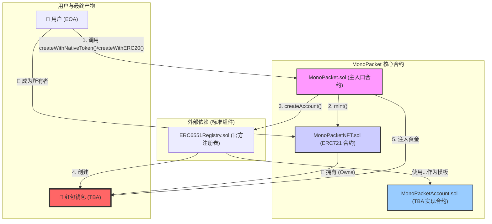

# MonaPacket

本仓库包含基于 Foundry 的 MonaPacket 合约与脚本，当前实现以 `contracts` 目录为主：
- 核心合约：`MonaPacket.sol`、`MonaPacketNFT.sol`、`MonaPacketAccount.sol`、`ERC6551Registry.sol`
- 测试：位于 `contracts/test/`，覆盖创建、TBA 执行、注册表分支、部署脚本写文件等
- 部署脚本：`contracts/script/MonaPacket.s.sol`，将部署信息写入 `contracts/deployments/MonaPacket.json`

### 部署脚本

```bash
cd contracts
forge build
export PRIVATE_KEY=<hex_private_key>
forge script script/MonaPacket.s.sol:MonaPacketScript \
  --broadcast --rpc-url <your_rpc_url>
```

运行后会在 `contracts/deployments/MonaPacket.json` 生成部署信息文件。

## 系统架构 (System Architecture)



## 智能合约接口文档 (Smart Contract API)

IMonaPacket（主入口合约），用户交互的中心枢纽。

```
interface IMonaPacket {
    // 事件：红包创建
    event MonaPacketCreated(
        address indexed tba,
        address indexed recipient,
        uint256 indexed tokenId,
        address token,
        uint256 amount
    );

    // 使用原生币创建红包
    function createWithNativeToken(address recipient)
        external
        payable
        returns (address tba);

    // 使用 ERC20 创建红包
    function createWithERC20(address recipient, address erc20, uint256 amount)
        external
        returns (address tba);

    // 使用 EIP-2612 Permit 创建红包
    function createWithERC20Permit(
        address recipient,
        address erc20,
        uint256 amount,
        uint256 deadline,
        uint8 v,
        bytes32 r,
        bytes32 s
    ) external returns (address tba);

    // 预测/查询某 tokenId 对应的 TBA 地址
    function getAccount(uint256 tokenId) external view returns (address);

    // 管理：更新后续 TBA 的实现地址
    function setAccountImplementation(address newImplementation) external;
}
```

IMonaPacketNFT（NFT 合约），代表“红包封皮”的 ERC-721 合约。

```
interface IMonaPacketNFT is IERC721 {
    // 仅 MonaPacket 合约可调用
    function mint(address to) external returns (uint256 tokenId);
}
```

IMonaPacketAccount（红包钱包合约），TBA 的具体实现。

```
interface IMonaPacketAccount {
    // 接收原生币
    receive() external payable;

    // 返回绑定的 NFT 元数据
    function token()
        external
        view
        returns (uint256 chainId, address tokenContract, uint256 tokenId);

    // 执行计数（每次 execute 自增）
    function state() external view returns (uint256);

    // 当前所有者（等于绑定 NFT 的 owner）
    function owner() external view returns (address);

    // ERC-6551 签名者校验接口
    function isValidSigner(address signer, bytes calldata context)
        external
        view
        returns (bytes4 magicValue);

    // 仅支持 operation=0 的调用执行
    function execute(
        address to,
        uint256 value,
        bytes calldata data,
        uint8 operation
    ) external payable returns (bytes memory);
}
```

### 测试与覆盖率

```
╭------------------------------+------------------+------------------+----------------+----------------╮
| File                         | % Lines          | % Statements     | % Branches     | % Funcs        |
+======================================================================================================+
| script/MonaPacket.s.sol      | 96.55% (28/29)   | 100.00% (33/33)  | 100.00% (0/0)  | 66.67% (2/3)   |
| src/ERC6551Registry.sol      | 82.86% (29/35)   | 81.82% (27/33)   | 0.00% (0/2)    | 100.00% (2/2)  |
| src/MonaPacket.sol           | 100.00% (33/33)  | 97.06% (33/34)   | 83.33% (5/6)   | 100.00% (7/7)  |
| src/MonaPacketAccount.sol    | 100.00% (32/32)  | 100.00% (33/33)  | 100.00% (7/7)  | 100.00% (7/7)  |
| src/MonaPacketNFT.sol        | 100.00% (4/4)    | 100.00% (3/3)    | 50.00% (1/2)   | 100.00% (1/1)  |
| test/MonaPacket.t.sol        | 80.00% (32/40)   | 81.25% (26/32)   | 50.00% (2/4)   | 62.50% (10/16) |
| test/MonaPacketAccount.t.sol | 89.29% (25/28)   | 86.36% (19/22)   | 75.00% (3/4)   | 66.67% (6/9)   |
| Total                        | 91.04% (183/201) | 91.58% (174/190) | 72.00% (18/25) | 77.78% (35/45) |
╰------------------------------+------------------+------------------+----------------+----------------╯
```